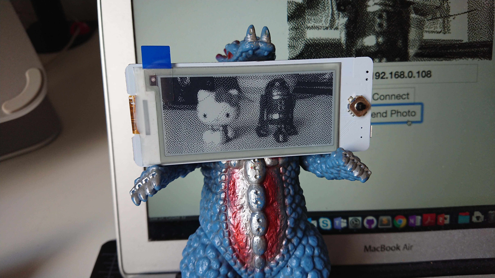

# Badgy Camera

	

This code sample demonstrates display photos on Badgy captured through the webcam. Photo on the canvas is dithered and converted to a byte stream, then sent to Badgy over WebSocket. 

## Instructions
1. Turn on Badgy and wait for it to connect, note the IP address displayed.
2. Open `badgy-camera.html` using Chrome. The browswer will prompt you for camera permissions, click "allow".
3. Enter the IP address and click connect
4. Click "Send Photo" to capture and send the photo to Badgy
