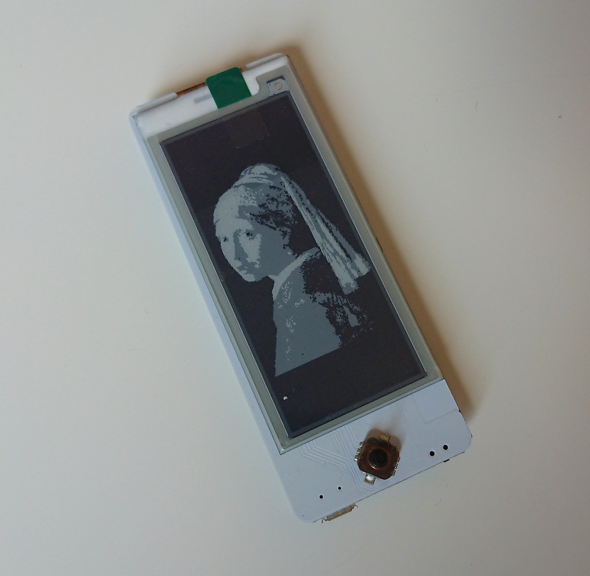
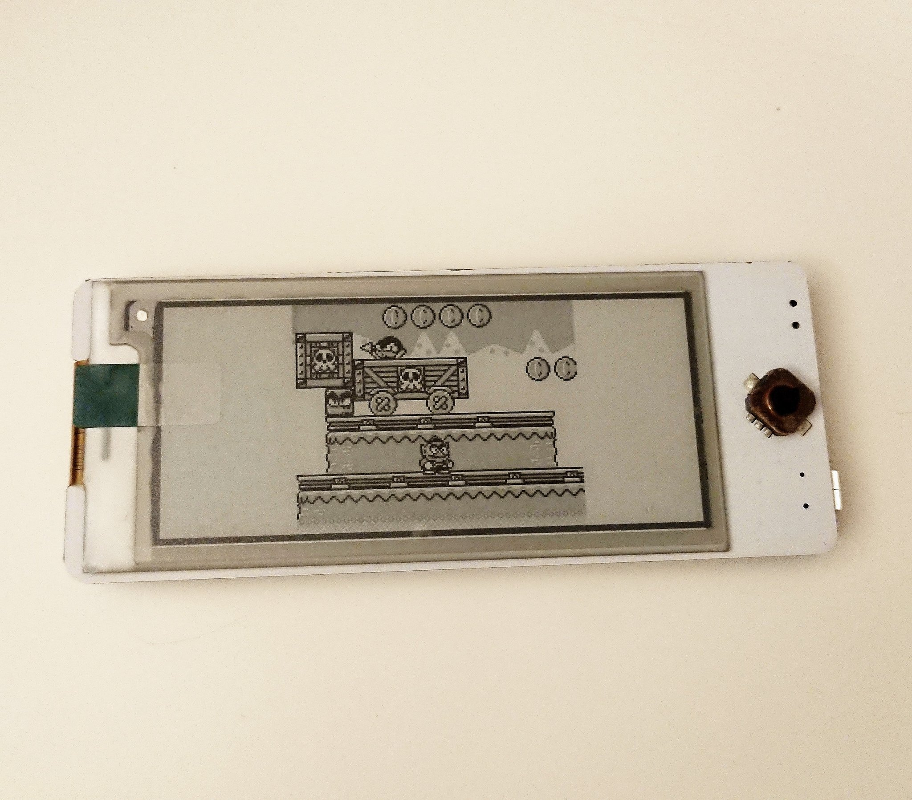
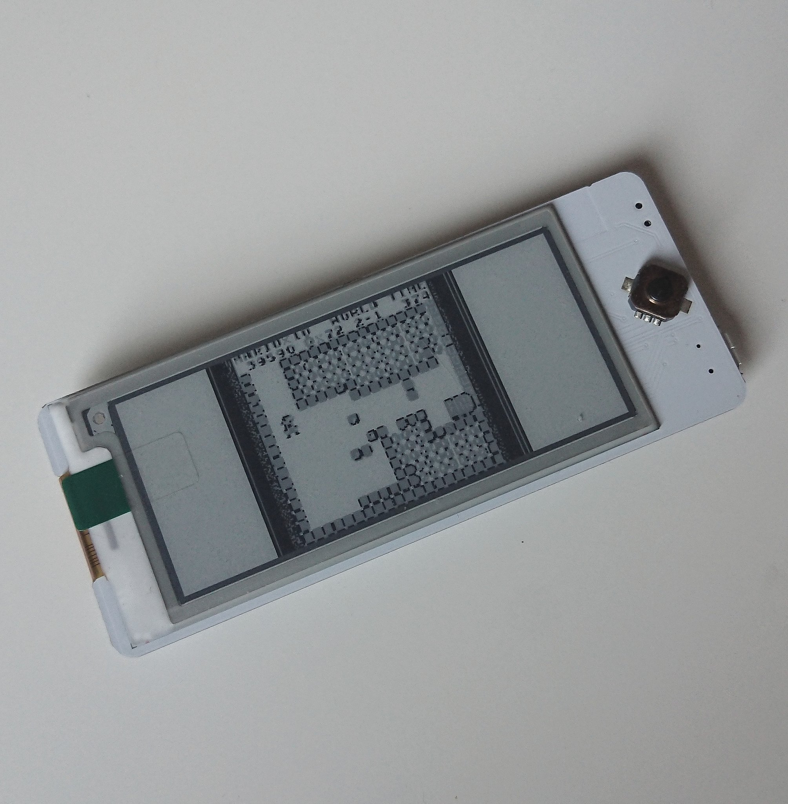

# Badgy Grayscale Demo

This code sample demonstrates displaying a 2-bit grayscale image (Black/Dark Gray/Light Gray/White). The image is converted to a byte array using the [Image2Lcd](https://www.waveshare.com/wiki/File:Image2Lcd.7z) tool.

	
  
  

The following settings were used to generate the example images:

* Output file type: C array
* Scan mode: Vertical scan
*	BitsPixel: 16 Color
*	Max Width: 296
*	Max Height: 128
*	Scan Right to Left: Checked
*	Reverse Color: Checked
*	Mirroring: Normal
