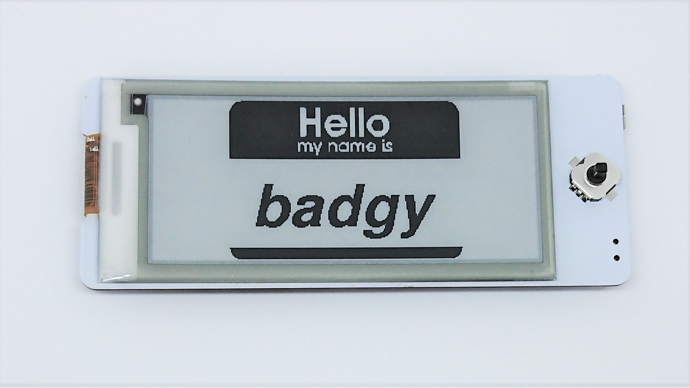

# Hello Name Badge

	

	

This code sample demonstrates displaying a "Hello my name is" badge on Badgy. The background image and is converted to a byte array from a PNG file and is stored in `hello.h`. The name is stored in a char array `const char* name = "badgy"` which can be changed to any text. It may be required to tweak the cursor location and font size in `showHello()` to perfectly position the text.

Power saving features are not enabled in this code sample and Badgy stays fully on. To conserve power, simply turn off Badgy as the e-paper display does not require power to maintain the displayed image.

## Instructions
- Download code sample & required libraries, and compile/upload in the Arduino IDE (1.8.5)
or
- Download the pre-compiled binary [hello.bin](https://github.com/sqfmi/badgy/raw/master/examples/hello/hello.bin) and upload using OTA
