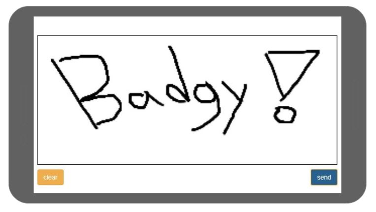
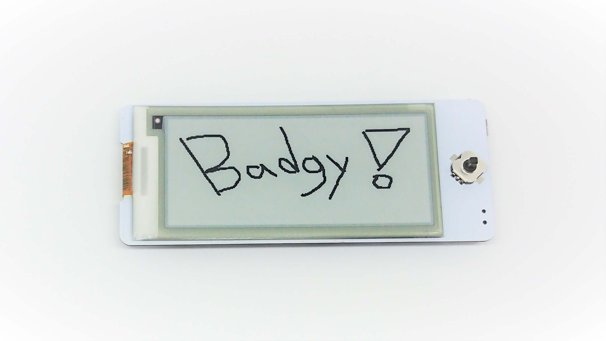

# WebSocket Draw

	

	

This code sample demonstrates drawing images on Badgy. Drawing done on the canvas is converted to a byte stream and sent to Badgy over WebSocket. 

## Instructions
1. Turn on Badgy and wait for it to connect, note the IP address displayed.
2. Edit `index.html` **line 58** and replace the IP address with Badgy's IP address e.g. `ws://192.168.0.113:81`.
3. Open `index.html` using Chrome or host it on a local server and open it on a mobile phone.
4. Draw on the canvas (using mouse or touch) and press **send**, your image should then appear on Badgy.
5. To clear the display, press **clear**